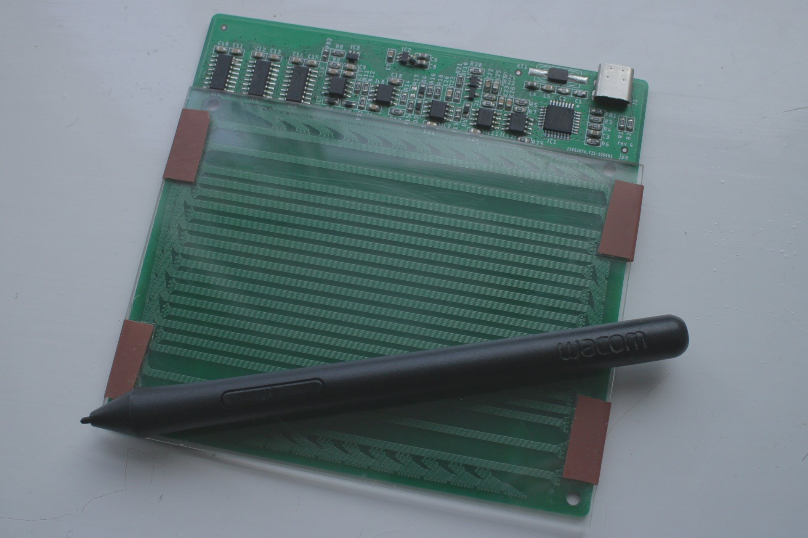

# opentablet

A small drawing-tablet like input device with high (1kHz) polling rates and low latency, designed to be compatible with a small number of Wacom pens. Only supports position tracking, not clicking or pen pressure.

This version was an early prototype. The analog front end has several shortcomings (noisy and limited range) and is overly complex for its intended task. Next version should solve these issues.

